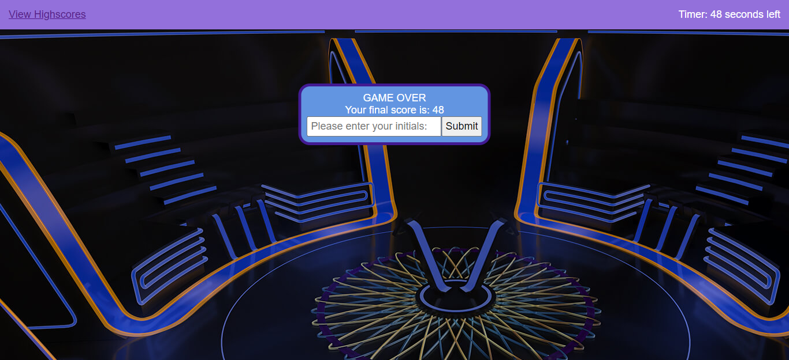

## Code Quiz

## Table of content :

- [_Project Link_](#project-link)
- [_About my Project_](#about-my-project)
- [_Screenshots_](#screenshots)

## Project Link

[_Give the quiz a try!_](https://misha244.github.io/code-quiz/)

## About my Project

I was tasked with creating a JavaScript themed quiz from scratch. That included building the HTML, CSS and JavaScript.

The quiz's style and colour scheme is inspired by _Who Wants to Be a Millionaire?_ I would like to eventually make the page resemble its format much more closely.

The quiz contains 5 multiple answer questions, but could very easily be expanded through simply adding on to the questions array.

On start, the introductionary form is replaced by the first question and the timer is triggered, starting its countdown from 60 seconds. When incorrect answer is selected, 10 points are deducted from the remaining time. Whatever time is left on completion of the quiz then becomes the user's score. An option is given to provide initials and submit the score. The user is then shown the page containing the high scores. They're given the option to clear the current high score log and/or go back to the start page and give the quiz another try.

## Screenshots

#### Landing page

#### Example of a question

#### Game Over page

#### High Scores page

## Fin
